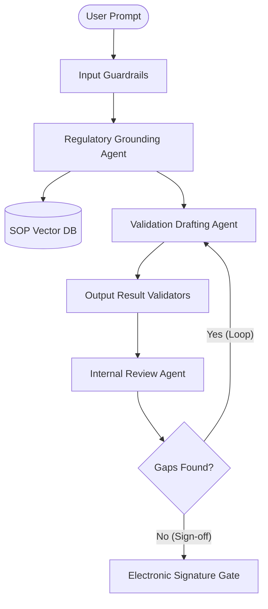

# Multi-Agent Computer System Validation (CSV) Platform

This platform implements a production-grade multi-agent orchestration pipeline designed to generate, ground, audit, and qualify validation documentation (e.g. User Requirement Specifications (URS), Installation/Operational/Performance Qualifications (IQ/OQ/PQ)) according to **GAMP 5** guidelines and **21 CFR Part 11 / EU Annex 11** electronic record compliance rules.

---

## 1. System Architecture & Multi-Agent Orchestration

The platform coordinates three specialized Pydantic AI agents:
1. **Regulatory Grounding Agent (`regulatory_grounding_agent`)**:
   - Leverages a local vector store containing company SOPs, regulatory documents, and templates.
   - Grounding query calculations classify target systems into appropriate GAMP categories (e.g. Category 3, 4, or 5).
2. **Validation Drafting Agent (`validation_drafting_agent`)**:
   - Formulates GxP validation drafts utilizing Grounding outputs and version-controlled Markdown prompt templates.
   - Employs self-correction feedback memories to learn from prior engineering review rejections.
3. **Internal Review Agent (`internal_review_agent`)**:
   - Reviews drafted files for compliance validation gaps and details required remedial revisions.



---

## 2. Compliance Guardrails & Real-Time Enforcement

To enforce rigid boundaries directly inside the execution lifecycle, the system runs:
- **Input Guardrails**: Scans user prompts for instruction override attempts (e.g., `"ignore instructions"`, `"bypass review"`) and halts execution with a `ComplianceViolationException`.
- **Data Residency Scans**: Validates drafted content to ensure no unauthorized external domains or foreign server URLs (e.g. AWS S3 buckets in foreign regions) are suggested.
- **SOP Cross-Reference Alignment**: Cross-checks cited SOPs against the registered database, blocking citation hallucinations.
- **Category 5 Design Specifications**: Verifies that custom software system (Category 5) drafts contain a dedicated software architectural/design section.
- **PII & Credentials Sanitization**: Filters and masks Social Security Numbers, patient names, and private keys before processing.

---

## 3. CI/CD Validation & GxP Software Qualification

### CI/CD Build Gates
- Executing `python run_validation_ci.py` compiles system performance logs, regression metrics, and writes an immutable verification record (`VALIDATION_RUN_REPORT.md`) containing code checksums.

### Software Qualification Protocol (IQ/OQ/PQ)
- The suite programmatically validates:
  - **Installation (IQ)**: Verifies runtime versions, packages (`pydantic`, `pydantic_ai`, `pypdf`, `logfire`), and vector db state.
  - **Operational (OQ)**: Tests high token limits, PII masking regex engines, and fallback retries.
  - **Performance (PQ)**: Conducts peak parallel load testing (10 concurrent requests) to verify schema compliance and average latency.
  - **Report**: Exiting with a `0` code compiles a GxP-compliant `SYSTEM_QUALIFICATION_REPORT.md`.

---

## 4. Local Quickstart

### Setup & Package Installation
Initialize the environment using `uv`:
```bash
uv sync
```

### Running Unit Tests
Execute the pytest suite (19 test cases covering RAG queries, signature loops, memory loops, and guardrails):
```bash
uv run pytest
```

### Executing the System Qualification Protocol (IQ/OQ/PQ)
Run the automated runner to evaluate environmental and boundary checks:
```bash
uv run python3 -m app.qualification.runner
```

### Headless CI Gate Runs
Run the CI gates to check performance benchmarks:
```bash
uv run python3 run_validation_ci.py
```

---

## 5. Docker Compose Execution

To build and launch the platform services inside isolated containers:

### 1. Start Services
```bash
docker compose up --build
```

This starts:
- **Frontend**: Serves the compiled React dashboard at `http://localhost:5173`.
- **Backend**: Synchronizes Python dependencies and automatically triggers the GxP System Qualification Suite on startup.

### 2. Inspect Qualification Suite Logs
```bash
docker logs -f gxp_validation_backend
```

### 3. Stop Services
```bash
docker compose down
```

